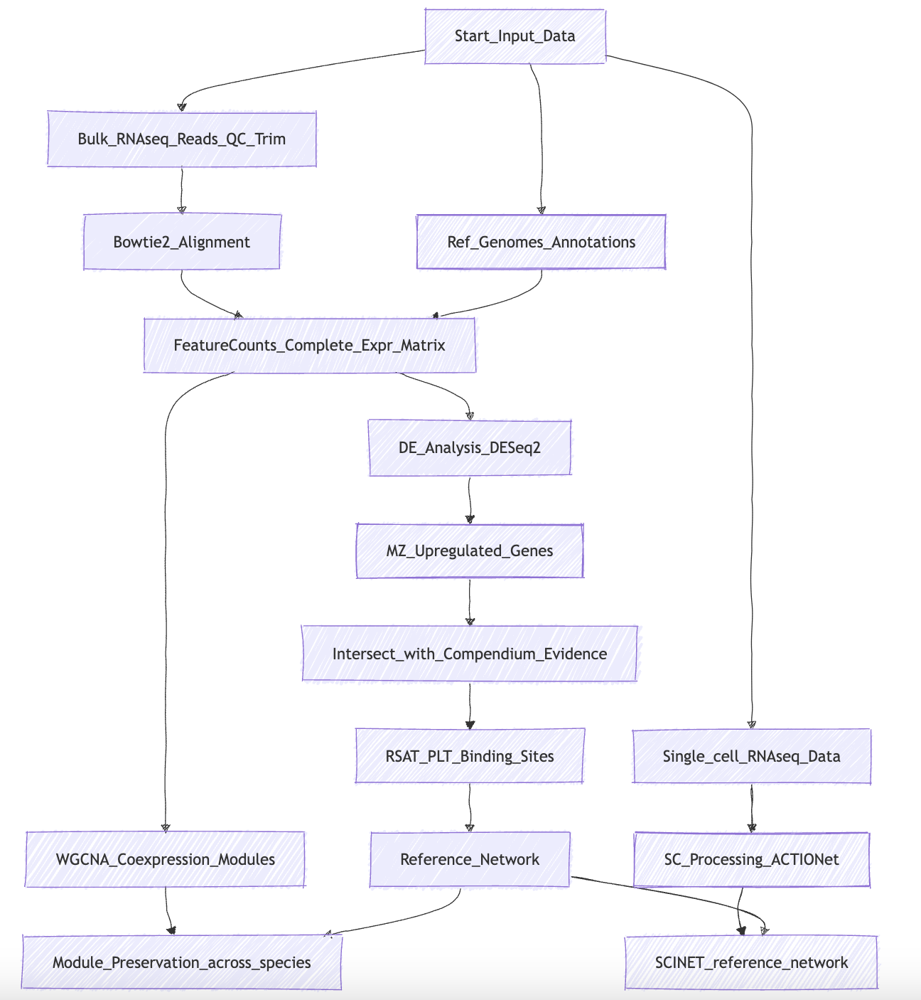

# README

# README: PLT Gene Regulatory Network Workflow

This repository provides a **Snakemake** workflow for modeling a gene regulatory network (GRN) driven by the PLETHORA (PLT) transcription factors in the root apical meristem (RAM) of multiple plant species. It integrates both **bulk RNA-seq** and **single-cell RNA-seq** data, performs **WGCNA**, differential expression analysis, ortholog detection, TF binding site scans, and final single-cell integration. The workflow references a central **Snakefile** and **config.yaml** for configuration details.

Below are instructions for installation, configuration, and running the workflow, followed by an overview of the analysis steps.

---

## 1. Prerequisites

1. **Conda / Mamba**  
   We strongly recommend [Conda](https://docs.conda.io/projects/conda/en/latest/) (or [Mamba](https://mamba.readthedocs.io/en/latest/)) to manage environments.

2. **Snakemake**  
   Install Snakemake into a dedicated environment. For example:
   ```bash
   conda create -n snakemake_env -c conda-forge -c bioconda snakemake
   conda activate snakemake_env
   ```

3. **Git LFS** (optional)  
   If you're storing large reference files (FASTAs, GFFs) in this repository, you may need Git LFS installed to properly pull them.

4. **Reference Data**  
   This pipeline expects you to have downloaded:
   - Raw RNA-seq data (e.g., from GEO GSE64665 for multiple species).
   - Genome FASTA + GFF3 annotation (converted to GTF if needed).
   - If single-cell data is used, the scRNA-seq dataset files from GSE152766.  
   You should place these in a consistent directory structure (see below).

---

## 2. Repository Contents

- **Snakefile**  
  The main workflow definition, controlling tasks for quality control, trimming, alignment, quantification, differential expression, WGCNA, BLAST ortholog detection, motif scanning, and single-cell integration.

- **config.yaml**  
  A user-modifiable configuration file specifying:
  - `organisms`: List of species to analyze.
  - `refOrganism`: The reference organism (commonly *Arabidopsis thaliana*).
  - `samples`: Root zone samples (e.g., MZ, DZ, EZ).
  - `feature`, `attribute`: FeatureCounts parameters (e.g., using `exon` as the feature or `gene_id` as the attribute).
  - `foldChange`, `softPower`, `mergeThreshold`, etc. for DE analysis and WGCNA.
  - `forceTOMCalc`, `forceBLAST`: Flags to force re-calculation of TOM or BLAST results.
  - `blast`: The BLAST mode (`best` vs. `bbh`).
  - `threads`: Number of CPU cores to use.
  - `envs`: Additional environment or package references (e.g., FastQC).

- **scripts/**  
  Various Bash, Python, and R scripts referenced by the workflow. These scripts perform:
  - RNA-seq QC and multiQC merges
  - Read trimming (Trimmomatic)
  - Bowtie2 alignment
  - FeatureCounts-based quantification
  - DESeq2 DE analysis
  - WGCNA adjacency and module detection
  - BLAST-based ortholog detection
  - RSAT TFBS scanning
  - Single-cell integration with SCINET / ACTIONET

- **others/** or **input/** (paths may vary)  
  Additional references, e.g., PLT IDs, GFFs, FASTA reference sequences, single-cell data.

- **output/**  
  Results, logs, and intermediate files are written here. The final network outputs—such as `network_table.csv` and `prop_table.csv`—are placed under `output/<organism>/NETWORK/` or as specified in the rules.

---

## 3. Configuration

Open **config.yaml** and edit parameters according to your setup:

```yaml
organisms: [
  Arabidopsis thaliana,
  Solanum_lycopersicum,
  Cucumis_sativus,
  Oryza_sativa_Japonica_Group,
  Glycine_max,
  Zea_mays
]

refOrganism: Arabidopsis_thaliana
samples: [MZ, DZ, EZ]
refGenes: [AT3G20840, AT1G51190, AT5G10510, AT5G17430, AT5G57390, AT5G65510]

feature: exon
attribute: gene_id

foldChange: 1
softPower: 11
mergeThreshold: 0.25
forceTOMCalc: False
forceBLAST: True
gmmThreshold: 0.5
blast: bbh
threads: 1
removeTempFiles: False

envs: {
  "fastqc": "fastqc"
}
```

**Key fields**:

- `organisms`: The species to analyze.  
- `samples`: The root zones (like MZ, DZ, EZ).  
- `refOrganism`: Typically *Arabidopsis thaliana*, used for referencing and ortholog detection.  
- `foldChange`: The log2 fold-change threshold for DE. If set to `1`, that implies a fold-change cutoff of 2.  
- `softPower`: WGCNA’s power parameter to achieve scale-free topology.  
- `mergeThreshold`: WGCNA module merging threshold.  
- `forceTOMCalc`, `forceBLAST`: Re-run topological overlap or BLAST if set to `True`.  
- `blast`: Use `bbh` (bidirectional best hits) or `best` (one-way hits).  
- `threads`: CPU cores used for parallel tasks.  
- `removeTempFiles`: Whether to keep or remove large intermediates (fastq, BAM, etc.).  
- `envs`: A dictionary if you have custom Conda environment names or environment modules.

---

## 4. Data Organization

Structure your input data, for example:

```
project/
├── data/
│   ├── Arabidopsis_thaliana/
│   │   ├── FASTA/
│   │   │   └── TAIR10.fa
│   │   ├── GTF/
│   │   │   └── TAIR10.gtf
│   │   └── FASTQ/
│   │       ├── MZ_1_R1.fastq.gz
│   │       ├── MZ_1_R2.fastq.gz
│   │       ...
│   ├── Solanum_lycopersicum/
│   ...
├── config.yaml
├── Snakefile
├── scripts/
│   └── ...
├── others/
│   └── plt.ids.txt
└── output/
    └── ...
```

Edit the Snakefile to point to the correct paths or keep them consistent with `config.yaml` references.

---

## 5. How to Run

1. **Clone this repository** (or place the Snakefile and scripts in your working directory).

2. **Check the `config.yaml`**  
   Make sure organisms, references, sample lists, and other settings match your data.  

3. **Activate conda** with Snakemake installed:  
   ```bash
   conda activate snakemake_env
   ```

4. **Dry-run** to preview commands:  
   ```bash
   snakemake --configfile config.yaml -n
   ```
   This prints all steps without executing them.

5. **Execute** with actual job scheduling:  
   ```bash
   snakemake --configfile config.yaml --cores 4
   ```
   or specify a cluster environment like SLURM or any HPC resource, e.g.:  
   ```bash
   snakemake --configfile config.yaml --cluster "sbatch ..." --jobs 10
   ```

**Tip**: If you want to re-run a specific portion (e.g., re-run BLAST or WGCNA), set `forceBLAST: True` or `forceTOMCalc: True` in `config.yaml` and re-run Snakemake.

---

## 6. Workflow Overview

Below is a high-level summary of the pipeline (the exact steps may vary depending on the Snakefile rules):



1. **Quality Control**:  
   - `fastqc` and `multiqc` to check read quality.  
   - Optional trimming with Trimmomatic if configured.

2. **Alignment**:  
   - Bowtie2 indexes the reference genome.  
   - Align reads for each sample.

3. **Quantification**:  
   - FeatureCounts merges coverage into gene-level counts.  
   - Low-expression genes are filtered.

4. **DE Analysis**:  
   - DESeq2 obtains log2 fold-change and identifies DEGs.  
   - Genes upregulated in MZ are found by intersection across comparisons.

5. **WGCNA**:  
   - R scripts build a co-expression adjacency.  
   - Modules are detected.  
   - Edge weight distributions are decomposed with a Gaussian mixture model.

6. **BLAST Orthology**:  
   - If `blast: bbh`, do a reciprocal BLAST between species.  
   - Build an ortholog table for cross-species comparisons.

7. **TFBS Scanning**:  
   - Using RSAT retrieve-seq and matrix-scan.  
   - Finds PLT binding sites in the promoter region of each gene.

8. **Single-Cell Integration (SCINET)**:  
   - If single-cell data is provided, it merges the Bulk GRN as a prior into SCINET or ACTIONET frameworks.  
   - Adjusts edge weights by cell type.

9. **Outputs**:  
   - Differential expression tables.  
   - WGCNA module membership.  
   - TFBS hits.  
   - Cross-species ortholog mapping.  
   - A final integrated GRN with properties (e.g. `network_table.csv`, `prop_table.csv`) in `output/...`.

---

## 7. Further Customization

- Add or remove species in `config.yaml` under `organisms`.
- Adjust DE thresholds (`foldChange`) or WGCNA parameters (`softPower`, `mergeThreshold`).
- Switch the BLAST approach to `best` or keep it at `bbh`.
- Decide whether to keep or remove large files by toggling `removeTempFiles`.

---

## 8. Troubleshooting

- **Missing dependencies**: Ensure Bowtie2, FeatureCounts, DESeq2, WGCNA, RSAT, and other scripts are in your PATH, or set up conda environments properly.
- **Directory paths**: The pipeline expects the reference and sample files in consistent subdirectories. Update the Snakefile if needed.
- **Partial re-runs**: If you suspect stale intermediate results, set `forceBLAST: True` or `forceTOMCalc: True` in `config.yaml`, or remove old files in `output/`.

---

## 9. Citation & Credits

This workflow references methods and software outlined in the paper describing the *Arabidopsis* PLT gene regulatory network. For each tool used (Bowtie2, DESeq2, WGCNA, clusterProfiler, RSAT, SCINET, etc.), please cite the corresponding publications.  

- **RNA-seq workflow**:
  Love MI, Huber W, Anders S. Moderated estimation of fold change and dispersion for RNA-seq data with DESeq2. Genome Biology. 2014 Dec 5;15(12):550
  Langmead B, Salzberg SL. Fast gapped-read alignment with Bowtie 2. Nat Methods. 2012 Apr;9(4):357–9
  Liao Y, Smyth GK, Shi W. featureCounts: an efficient general purpose program for assigning sequence reads to genomic features. Bioinformatics. 2014 Apr 1;30(7):923–30  
- **WGCNA**:
  Langfelder P, Horvath S. WGCNA: an R package for weighted correlation network analysis. BMC Bioinformatics. 2008 Dec 29;9(1):559  
- **RSAT**:
  Contreras-Moreira B, Castro-Mondragon JA, Rioualen C, Cantalapiedra CP, van Helden J. RSAT::Plants: Motif Discovery Within Clusters of Upstream Sequences in Plant Genomes. In: Hehl R, editor. Plant Synthetic Promoters: Methods and Protocols [Internet]. New York, NY: Springer; 2016 [cited 2023 Dec 26]. p. 279–95. (Methods in Molecular Biology). Available from: doi:10.1007/978-1-4939-6396-6_18  
- **SCINET**:
  Mohammadi S, Davila-Velderrain J, Kellis M. Reconstruction of Cell-type-Specific Interactomes at Single-Cell Resolution. cels. 2019 Dec 18;9(6):559–568.e4.  

If you have questions or encounter issues, please open an Issue or contact the maintainers.
